# 🌐 Azure NSGs & Application Security Groups  

**Type:** Microsoft Learn Lab — AZ-500 Lab  
**Skills:** Network Security Groups, Application Security Groups, Virtual Networking, Inbound Rules Hardening, IIS Deployment  

---

## 📌 Overview  
This project focused on configuring **Network Security Groups (NSGs)** and **Application Security Groups (ASGs)** in Azure to secure virtual machines while allowing necessary traffic. The lab demonstrated how to isolate management and web workloads while enforcing **least privilege access**.  

I made the following changes during implementation:  
- Restricted **RDP access** by setting the source to **my public IP only**, instead of opening port 3389 to the entire internet.  (You will find a covered the Source IP in the screenshot to protect my IP)
- Accidentally created the **VNet in East US** instead of West US, and had to move/recreate it to align resources in the same region.  

Finally, I deployed **IIS on the ProdWeb VM** and validated access via browser to confirm correct firewall rules.  

---

## 🎯 Objectives  
- Create a **Virtual Network (VNet)** with subnets for production workloads  
- Deploy a **Management VM (MgmtVm)** and a **Production Web VM (ProdWebVm)**  
- Create and assign **Application Security Groups** for segmentation  
- Configure **NSG inbound rules** for web and management access  
- Harden RDP by restricting access to a **trusted IP**  
- Deploy **IIS on the web server** and validate access externally  

---

## 🛠️ What I Did  

1. **Created Virtual Network & Subnet**  
   - Defined `10.0.0.0/16` space with a `Prod (10.0.1.0/24)` subnet.  
   - (Fixed mistake by moving VNet region from East US ➝ West US).  

2. **Provisioned Virtual Machines**  
   - **MgmtVm**: Windows Server 2019, used for RDP management.  
   - **ProdWebVm**: Windows Server 2019, configured as IIS Web Server.  

3. **Configured Application Security Groups (ASGs)**  
   - `ProdMgmtServers` (MgmtVm).  
   - `ProdWebServers` (ProdWebVm).  
   - Assigned NICs to appropriate ASGs.  

4. **Configured NSG Inbound Rules**  
   - Allowed **HTTP/HTTPS (80/443)** to `ProdWebServers`.  
   - Allowed **RDP (3389)** only from my **public IP** to `ProdMgmtServers`.  
   - Denied all other inbound traffic by default.  

5. **Deployed IIS on ProdWebVm**  
   - Used Azure “RunPowerShellScript” extension to install IIS:  
     ```powershell
     Install-WindowsFeature -name Web-Server -IncludeManagementTools
     ```  
   - Validated IIS landing page externally.  

6. **Validated Security & Connectivity**  
   - Confirmed NSG rules applied correctly.  
   - Verified RDP worked from my IP to MgmtVm only.  
   - Verified browser access to IIS homepage on ProdWebVm.  

---

## 📸 Screenshots  

- **Virtual Network Creation**  
  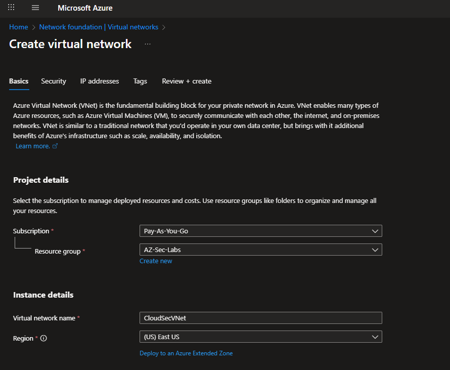  
  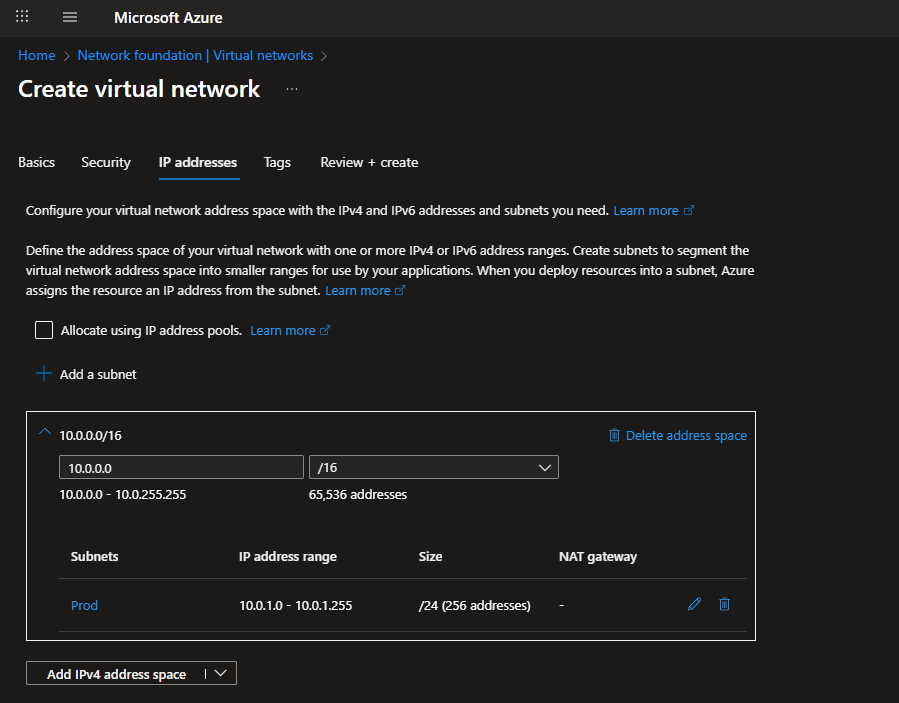  

- **Virtual Machine Deployments**  
  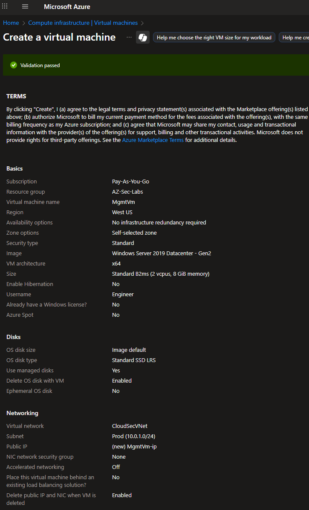  
  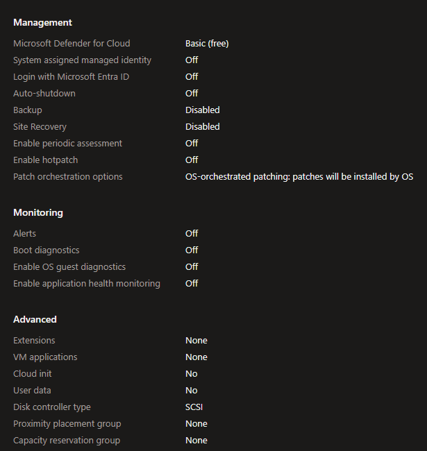  
  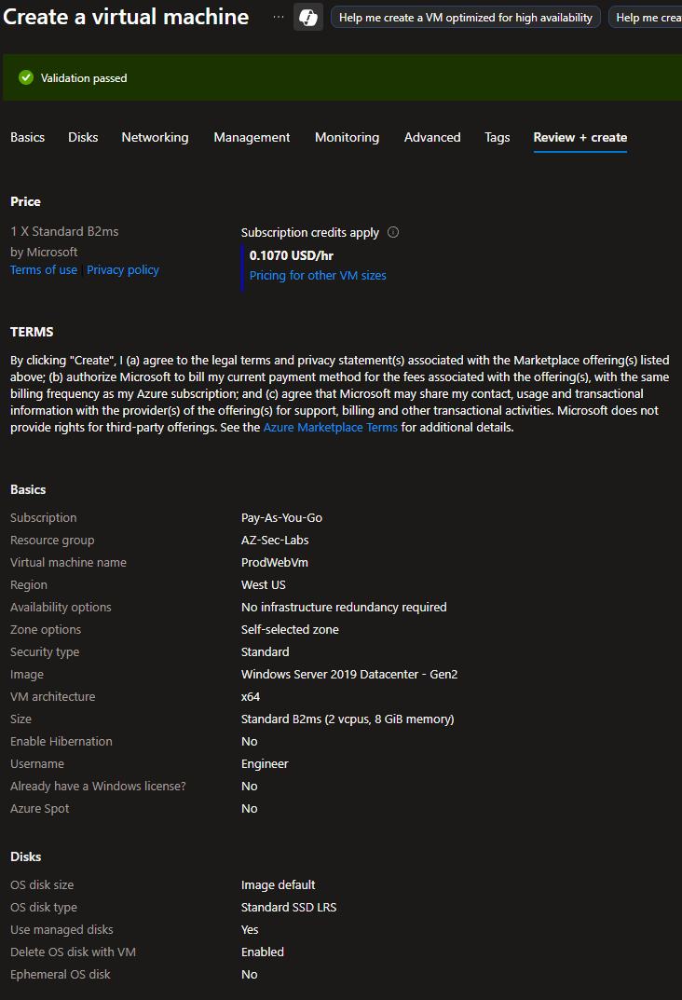  
  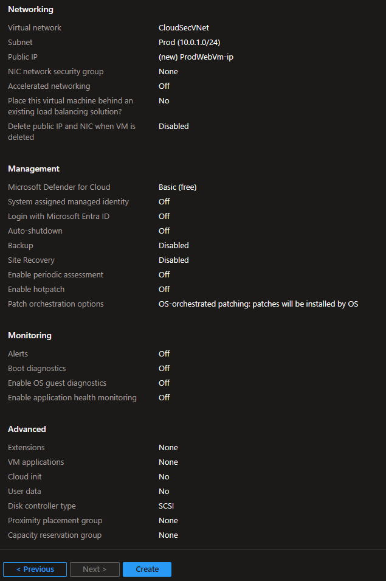  

- **Application Security Groups**  
  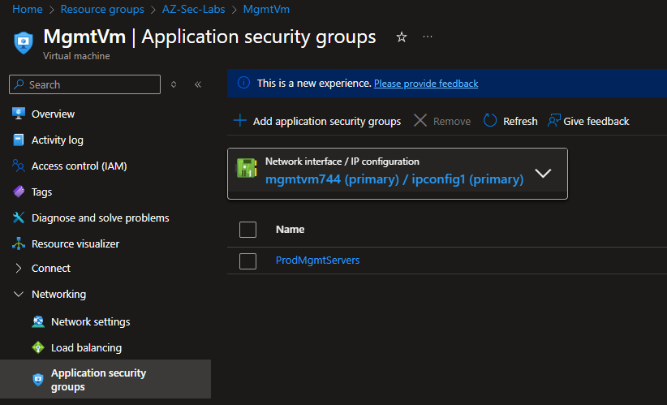  
  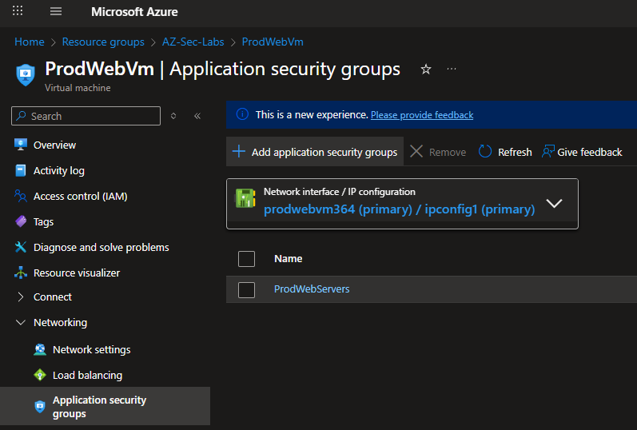  
  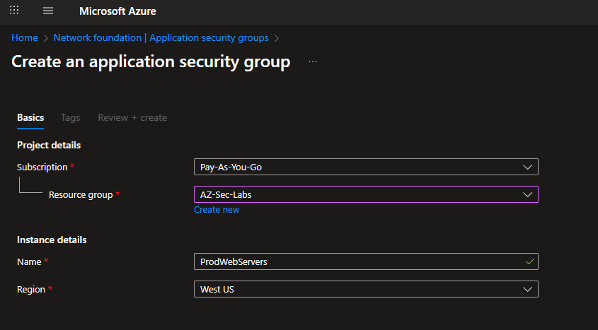  

- **NSG Inbound Rules**  
  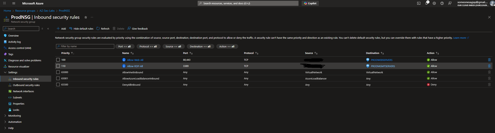  

- **Resource Group Overview**  
  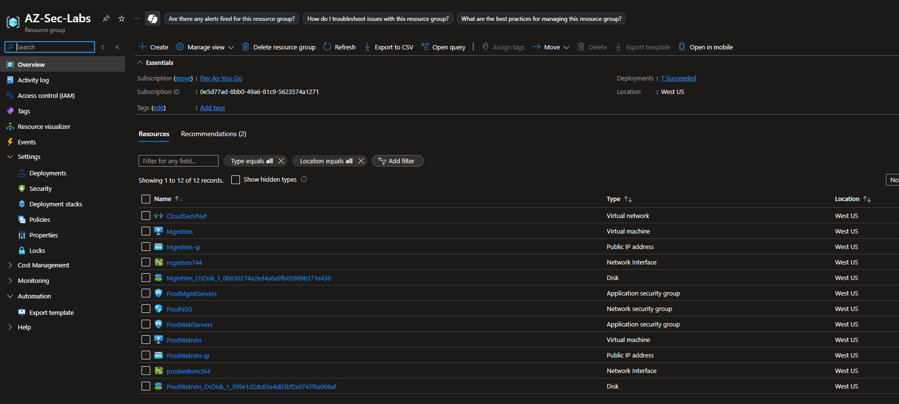  

- **Deploying IIS on ProdWebVm**  
  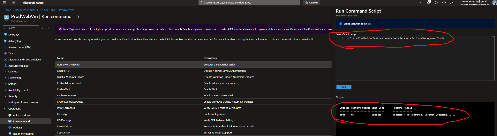  

- **Validation Tests**  
  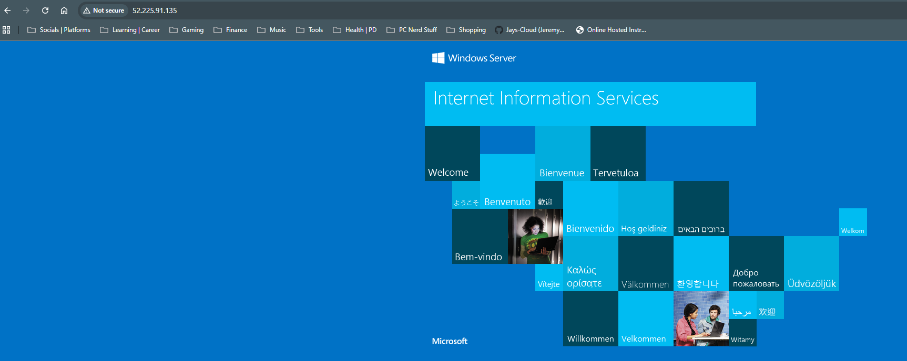  
  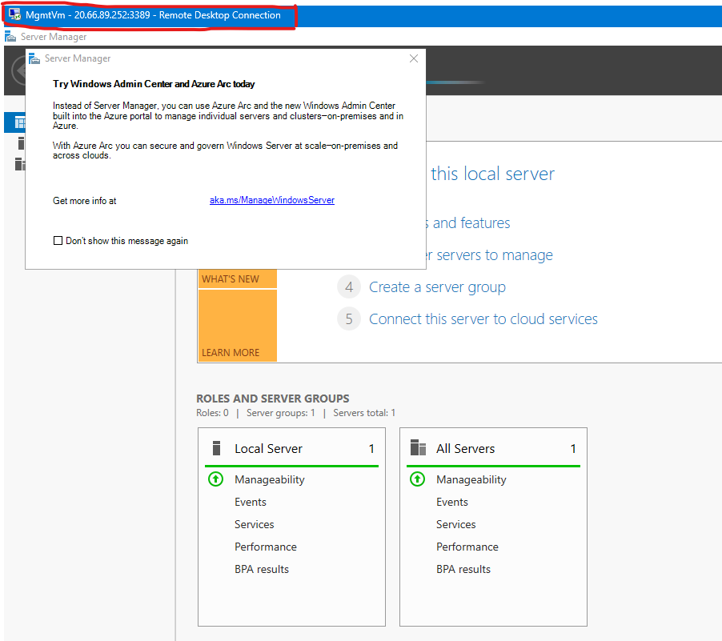   

---

## 📚 Key Takeaways  
- Restricting **RDP to a single IP** dramatically reduces attack surface.  
- **ASGs simplify NSG management** by grouping VMs logically.  
- Proper **region alignment** of VNets + resources is critical for connectivity.  
- IIS web server deployment provided a quick way to **validate firewall rules**.  

---

## 📖 References  
- [Microsoft Learn — Configuring Network Security Groups](https://microsoftlearning.github.io/AZ500-AzureSecurityTechnologies/Instructions/Labs/LAB_02_NSGs.html)  
- [Azure NSG Documentation](https://learn.microsoft.com/azure/virtual-network/network-security-groups-overview)  
